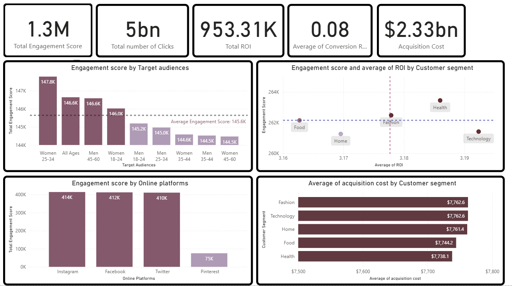

# Social Advertisement Analytics
This is project of data analytics about social advertisement.  
The dataset covers key performance indicators (KPIs) such as acquisition cost, conversion rates, ROI, and engagement scores. 

**_Conversion Rate_**: The percentage of clicks that led to successful conversions (e.g., sales, signups). 
**_ROI (Return on Investment)_**: The financial return generated from each campaign. 
**_Engagement Score_**: A composite score representing user interaction levels with the campaigns. 
**_Acquisition Cost_**: The total cost to acquire customers through the campaigns. 

From our dashboard, I analyzed our social advertising campaigns.
The main topics shown are catagorized by   **Target audiences**, **Online platform** and **Customer segment**. 

- **_Target audiences_** is campaings catogorized by age and gender of the audiences. 
- **_Online platforms_** is campaings catogorized by advertising platforms such as Facebook, Instagram, Twitter (X), and Pinterest.  
- **_Customer segments_** is campaings that catogorized by products categories such as Food, Home, Fashion, Health and Technology.  

## Data Analysis
- Among the target audiences, women aged 25–34 have the highest engagement score. When comparing each group to the average engagement score by target audience, women aged 25–34, audiences of all ages, men aged 45–60, and women aged 18–24 exceed the average. This implies that these groups are highly engaged with the advertisements. 

- Among the online platforms, Instagram has the highest engagement score. Overall, Instagram, Facebook, and Twitter (X) have similar engagement scores, while Pinterest has the lowest engagement score at only 75k. 

- Among the customer segments, Technology has the highest ROI. Although it generates the highest ROI compared to other segments, it has a relatively low engagement score. In addition, its advertising cost is the second highest among all segments, which suggests that investing in technology advertisements can generate strong returns, but requires a higher investment budget compared with other segment. Moreover, Fashion and Health are also interesting segments because they combine high ROI with high engagement scores, making them strong candidates for increased advertising investment.
